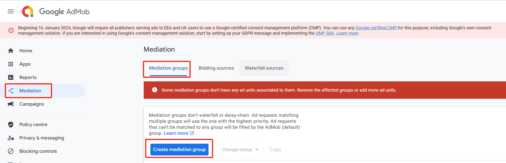
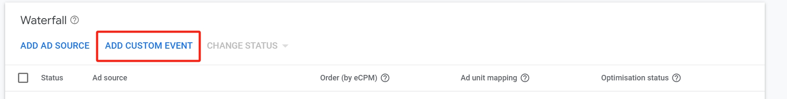
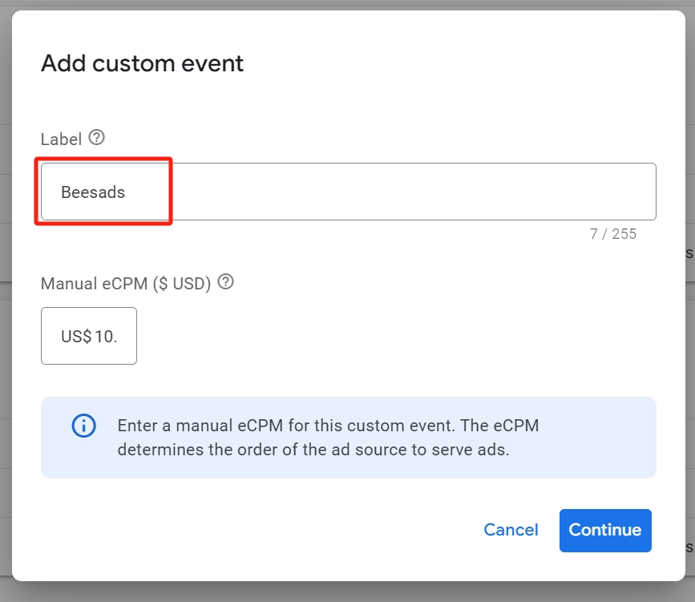
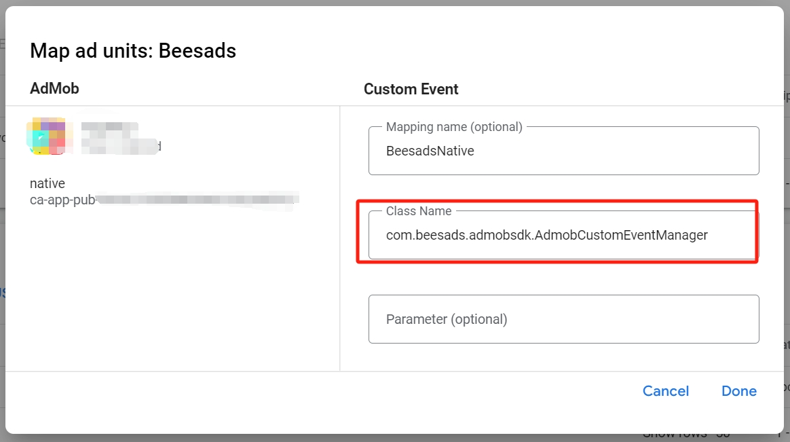

# Beesads


## Integrate Beesads with Admob Mediation

### 1. Support
- Banner
- Interstitial
- Rewarded
- Native

### 2. Import adapter into your app/game

#### 2.1 Gradle（Recomend）
Add the following implementation dependency with the latest version of the adapter in the app-level build.gradle file:

build.gradle (Module)

``` groovy
dependencies {
    implementation fileTree(dir: 'libs', include: ['*.jar'])
    // required google ads
    implementation 'com.google.android.gms:play-services-ads:22.4.0'
    // ⬇ Beesads implementation
    implementation "io.github.beesads:b4Admob:1.0.1"
}
```

#### 2.2 aar

aar file: [link](android/1.0.1/b4Admob.aar)

### 3 Configure mediation settings for your AdMob ad unit
#### 3.1 Step1: Create an mediation
Create a mediation group for advertising slots on the Admob mediation platform.Click "Mediation" -> "Mediation Group" to create a mediation group and select the specified ad type.




#### 3.2 Step2: Add BeeAds to the mediation group
a) Click to enter the mediation group, scroll down to waterfall flow, and click "Add Custom Event".



b) Fill in the relevant information and click Continue.
- Tag: <font color=red>Beesads</font>
  


#### 3.3 Step3: Map ad units
a) Class Name：<font color=red>com.beesads.admobsdk.AdmobCustomEventManager</font>
>The content with a red background must be filled in

b) Parameter：Fill in the advertising ID of google ad manager


