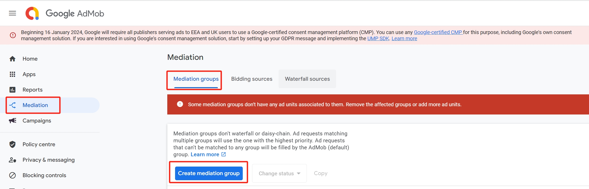
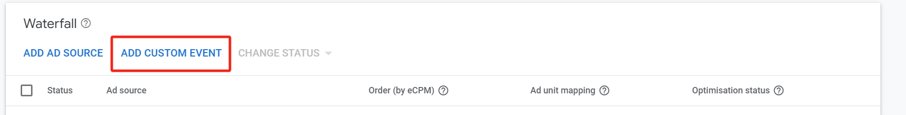
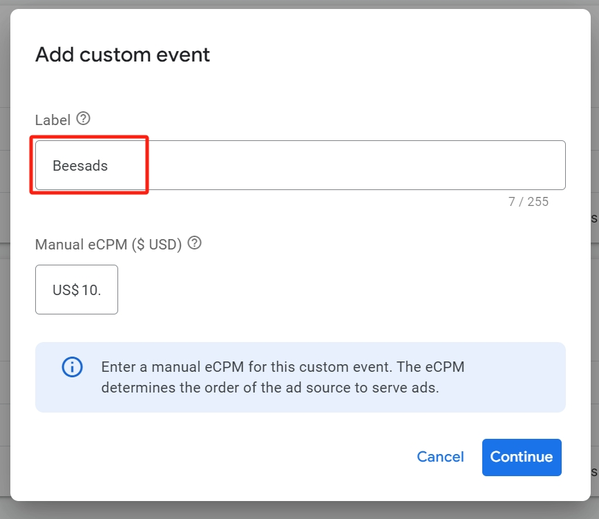
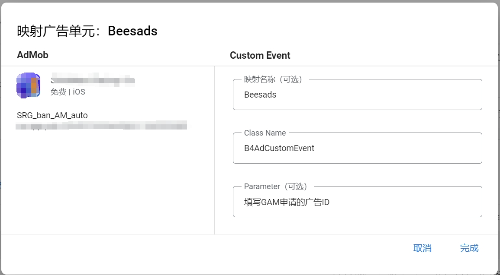

# Beesads - iOS

## Integrate Beesads with Admob Mediation

### 1. Support

- Banner
- Interstitial
- Rewarded
- Native

### 2. Import adapter into your app/game

sdk file: [link](ios/B4CustomEvent.zip)

* Unzip and add to your XCode project.
* Swift project need to add this to bridge header.

```
#import "B4AdCustomEvent.h"
#import "B4AdCustomEventIntertitial.h"
#import "B4AdCustomEventBanner.h"
#import "B4AdCustomEventRewarded.h"
#import "B4AdCustomEventNativeAd.h"
```


### 3 Configure mediation settings for your AdMob ad unit

#### 3.1 Step1: Create an mediation

Create a mediation group for advertising slots on the Admob mediation platform.Click "Mediation" -> "Mediation Group" to create a mediation group and select the specified ad type.



#### 3.2 Step2: Add BeeAds to the mediation group

a) Click to enter the mediation group, scroll down to waterfall flow, and click "Add Custom Event".


b) Fill in the relevant information and click Continue.

- Tag: <font color=red>Beesads</font>



#### 3.3 Step3: Map ad units

a) Class Name：<font color=red>B4AdCustomEvent</font>

> The content with a red background must be filled in

b) Parameter：Fill in the advertising ID of google ad manager

